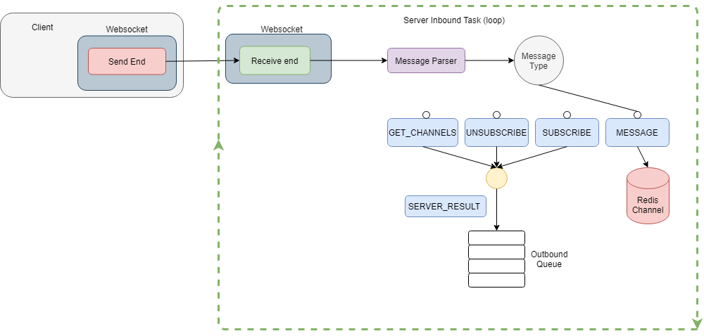
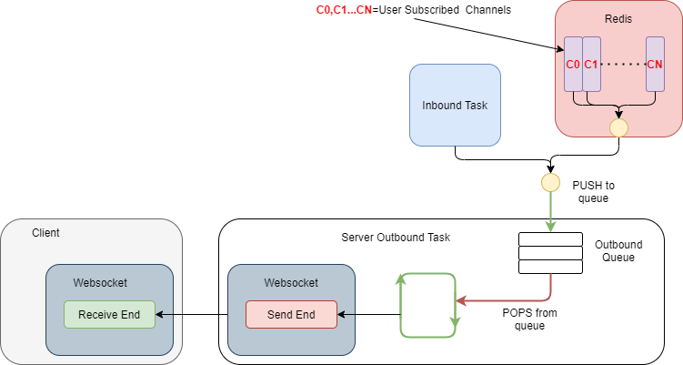
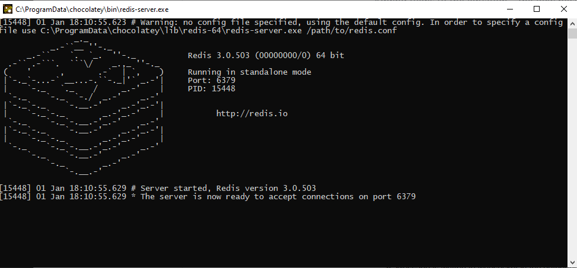
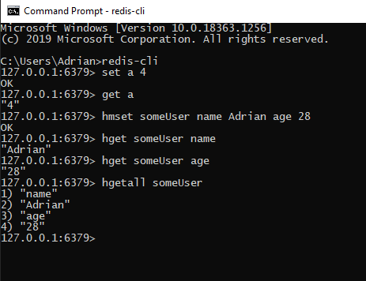
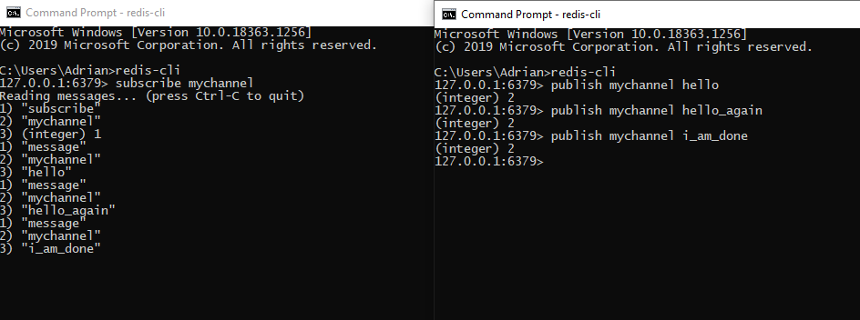

# Introduction

This will be a multi-part series in which we are going to build from scratch a chat application . In this article we are going to build the chat server which is the backbone of the chat application using the following technologies:

- ASP NET Core
- Redis
- Websockets protocol


Supported Features:

- subscription to one or multiple chat rooms
- unsubscription from target/all chat rooms
- sending messages to target chat room
- receiving messages from all subscribed chat rooms

## Motivation

Ever since i started playing online games in middle-school back in 2003 (Warcraft 3) , i have been using messaging applications in order to communicate with my peers. The first such application  which in time became ubiquitous was Skype.

I have come to love it since it would enable me and  my friends to send messages, record audio, share screens.

Besides gaming ,we were also using it  for sharing school material(s) , homework discussions and why not ,  school gossip :D

Years after completely abandoning gaming and dabbling for some time in areas such as Industrial Automation , Embedded Devices i rediscovered my passion for chat apps , but this time i was poised to create them.

## General Mechanics

So lets say i am a user Adrian and i want to connect with my buddy , Vasi ,  and start exchanging messages. We will define all interactions between me and Vasi as belonging to a CHANNEL.

A typical flow would be the following:

- channel participant connects to server and subscribes to given channel
- participant starts sending messages to the server to target channel while also receiving incoming messages from target channel
- participant disconnects from the server and subsequentally from channel

Important thing to note is that , at any given time ,  there could be multiple such groups of people wanting to connect and communicate. Therefore , you can view the application as  a group of channels like in the image below:


Another important note is that there is nothing stopping a given user to subscribe to multiple channels.

As you can see from above , all messages sent by a channel participant will be **broadcasted** to **all** members of that channel , including the sender.

# Architecture


## System Overview


- **Server**:  ASP NET Core Web application - the server where our logic will run handling client operations (subscribe/unsubscribe/publish message/get channels)
- **Database** : Redis -  serving as:
  - Data bus - we will be using the Publish/Subscribe functionality of Redis in order for clients to receive messages from subscribed channels.More on this can be found in the redis documentation [here](https://redis.io/topics/pubsub).
  - Storage medium , holding client data such as subscribed channel
- **Communication Protocol** : Since this is a chat application where the communication between a connected client and the given server is bidirectional (client sends messages , but also expects notifications from subscribed channel(s) ) ,  the protocol we will be using is **Websockets**.


## Flow

By flow we will be referring to the way both inbound- messages arriving from the client  and outbound messages  sent to the client are handled and where and how does the Websocket object fit in as well as the Redis database.

### Inbound Task



The inbound task is basically a loop running in a  `System.Threading.Task` for those familiar with the `.NET` Ecosystem (an operation which is dispatched over the framework's  thread pool  , more on it [here](https://docs.microsoft.com/en-us/dotnet/api/system.threading.tasks.task?view=net-5.0)).

This task gets spawned at the begining of the session - when the user connects to the server via a upgradeable  http-to-websocket request .

#### Message types

Inside the inbound Task we will receive messages from the websocket connection and it is our responsibility to handle them accordingly.Therefore  the following messages have been defined:


| Message Type | Arguments | Action Performed |
| - | - | - |
| <i>SUBSCRIBE</i> | `Client ID`, `Channel` | Subscribes to Redis`Channel`  or sends back to client a SERVER_RESULT message with the failure reason ( already subscribed/ID mismatch) |
| UNSUBSCRIBE | `Channel` | Unsubscribes from Redis Channel or sends to client a SERVER_RESULT message with the reason for failure |
| MESSAGE | `ClientID`,<br />`Channel`,<br />`Payload` | Publishes`Payload` to target Redis  `Channel` on behalf of `Client ID` |
| GET_CHANNELS | `Client ID` | Retrieves all the channels that the`ClientID` is subscribed to. |

**Notes**:

- We did not include in the table the message of type`SERVER_RESULT` since this is an outbound message. The server sends this message to the client as the result of the attempted operation !
- The `SERVER_RESULT` messages , as you can see ,  are not written to the websocket , but to an Outbound Queue (this will be explained in the next section : *The Outbound Task* ) !

### Outbound Task



The outbound task is a asynchronous task started from the  inbound task (during its inception).

As long as there are messages available in the queue we pop them  and send them to the client over the websocket connection.

When there are no messages inside the queue, the task blocks , awaiting new ones.

#### The Outbound Queue

The outbound queue acts as a sink for all producers as can be seen from the picture.In our case the producers are:

- **Inbound Task**: The messages that the server sends back to the client (messages of type SERVER_RESULT)
- **Redis**:  All messages that are published on channels on which our user is subscribed to.

# Implementation

## Prerequisites

Those familiar with setting up /using Redis and  .NET can skip this section.

### Installing Redis

For this solution you will need to install Redis Server . You can download it from [here](https://redis.io/download).

For windows users (me included) the easiest way to install redis is via the package manager *chocolatey* from  [here](https://chocolatey.org/install) . Once installed  from a terminal just run:

`choco redis`

If the install was successful from a terminal run

`redis-server`

and you should see the below output which indicates your redis server is up and running.



##### Using Redis-Cli

With the `redis-server` started  you can start playing with redis using the `Redis-Cli`from a terminal with the command`redis-cli`.



You can also test the `publish-subscribe` feature of redis by opening two `redis-cli` like below:



`redis-cli` can be used as a debugging/diagnosis tool , especially in our pubslish-subscribe scenario where you can easily hook up to a target channel and see if your messages get published/delivered.

### NET 5.0

For this application we are using .NET 5.0 and you can download it from  [here](https://dotnet.microsoft.com/download/dotnet/5.0).

## Source Code

We will be starting our project from a template of type `ASP NET Core Web Application`.

### Main

```cs

 /// The entrypoint in our application
 /// Constants.SERVER_URL is a default url string eg : localhost:8300

 public class Program {
        public static void Main(string[] args) {
            CreateWebHostBuilder(args).Build().Run();
        }

        public static IWebHostBuilder CreateWebHostBuilder(string[] args) {
            var webhostbuilder = WebHost.CreateDefaultBuilder(args)
                .UseUrls(Constants.SERVER_URL)  
                .UseStartup<Startup>();
            return webhostbuilder;
        }
    }
````

```cs
 /// Called above by extension method `UseStartup`
 /// Constants.REDIS_CONNECTION is a plain string , eg: localhost:6379  (6379 is the default redis port)

 public class Startup {

        public IConfiguration Configuration { get; }

        public Startup(IConfiguration configuration) {
            Configuration = configuration;
        }  
        public void ConfigureServices(IServiceCollection services) {
            services.AddControllers();
            ConnectionMultiplexer mux = ConnectionMultiplexer.Connect(Constants.REDIS_CONNECTION);
            services.AddSingleton(mux);
        }
        public void Configure(IApplicationBuilder app) {
            app.UseRouting();
            app.UseWebSockets();
            app.MapWhen(y => y.WebSockets.IsWebSocketRequest, a => a.UseMiddleware<SocketWare>());
        }
    }
````

The above sections are mandatory in any `ASP NET Core` application. The `Program.Main` starts the application and will  use the `Startup` class to configure it.

The `ConnectionMultiplexer` is our connection to the redis database and will be injected as a singleton resource in our application. Connected clients will use the multiplexer as a factory for subscriptions to target channels.

### Middleware

In the `Startup` class  `Configure` method above notice the `MapWhen`extension . Based on a predicate it will route  all  requests to the  specified [ASP NET Core Middleware](https://docs.microsoft.com/en-us/aspnet/core/fundamentals/middleware/?view=aspnetcore-5.0).

In our case:

- predicate = request should be of type websocket
- middleware is of type `SocketWare` (presented below)

```cs
public class SocketWare {
        private RequestDelegate next;
        private ConnectionMultiplexer mux;
        public SocketWare(RequestDelegate _next, ConnectionMultiplexer mux) {
            this.next = _next;
            this.mux = mux;
        }

        ///Called by the framework on each websocket request
        public async Task Invoke(HttpContext context) {
            using (var socket = await context.WebSockets.AcceptWebSocketAsync()) {
                ChatClient client = new ChatClient(this.mux);
                await client.RunAsync(socket);
            }
        }
    }
```

The `ConnectionMultiplexer` is passed using dependency injection  - remember it was injected in the `Startu.ConfigureServices` method !

The `Invoke` method  is a minimal requirement for any ASP NET middleware so that the framework knows to route the incoming request , and lets you handle it.

Remember the  `Startup.Configure` method , the predicate of `MapWhen` ; this middleware will be invoked only for websocket requests !

### Chat Client

This is the core of the application and since it is the most complex part i will post the entire component , and will explain it afterwards.

```cs
 public sealed class ChatClient {

        private const int BUFFER_SIZE = 1024;
        private State state = new State();
        private BlockingCollection<string> outboundQueue = new BlockingCollection<string>();
  
        private Action<RedisChannel, RedisValue> onRedisMessageHandler = null;
        public Action<RedisChannel, RedisValue> OnRedisMessageHandler {
            get {
                if (this.onRedisMessageHandler == null) {
                    this.onRedisMessageHandler = new Action<RedisChannel, RedisValue>((channel, value)  => this.outboundQueue.Add(value));
                }
                return this.onRedisMessageHandler;
            }
        }  


        //Constructor -receives the multiplexer
        public ChatClient(ConnectionMultiplexer mux) {
            this.state.subscriber = mux.GetSubscriber();
            this.state.redisDB = mux.GetDatabase();
        }


        //entrypoint -starts asynchronous outbound task
        public async Task RunAsync(WebSocket socket) {
            this.state.outboundTask = Task.Run(async () => {
                foreach (var item in this.outboundQueue.GetConsumingEnumerable()) {
                    var bytes = Encoding.UTF8.GetBytes(item);
                    await socket.SendAsync(bytes,WebSocketMessageType.Text,true,CancellationToken.None);
                }
            });
            await this.InboundLoopAsync(socket);
        }
  


        // inbound task - receives messages ,parses them and handles them accordingly
        // on loop end - triggers the cleanup routine
        private async Task InboundLoopAsync(WebSocket socket) {

            byte[] inboundBuffer = ArrayPool<byte>.Shared.Rent(BUFFER_SIZE);   
            try {
                while (true) {
                    WebSocketReceiveResult wsResult = await socket.ReceiveAsync(inboundBuffer,CancellationToken.None);
                    if (wsResult.MessageType == WebSocketMessageType.Close) {
                        ArrayPool<byte>.Shared.Return(inboundBuffer);
                        return;
                    }
                    byte[] incomingBytes = inboundBuffer[0..wsResult.Count]; 
                    WSMessage message = JsonSerializer.Deserialize<WSMessage>(Encoding.UTF8.GetString(incomingBytes));
                    await this.HandleMessageAsync(message); 
                }
            } finally {
                await this.CleanupSessionAsync();
            }
        }

       // cleanup routine
       //cleans redis hashset containing subscribed channels && subscriptions to said channels
        private async Task CleanupSessionAsync() {
            foreach (var channelHash in await this.state.redisDB.HashGetAllAsync(this.state.ClientId)) {
                await this.state.subscriber.UnsubscribeAsync(channelHash.Name.ToString(), this.OnRedisMessageHandler);
            }
            await this.state.redisDB.KeyDeleteAsync(this.state.ClientId);
        }

    }
````

**Notes**

The `State` variable:

```cs
   internal class State {
        public string ClientId { get; set; }
        public Task outboundTask;
        public ISubscriber subscriber;
        public IDatabase redisDB;
    }
```

- `ISubscriber`is a component of`StackExchangeRedis`library and  is used`subscribe/unsubscribe`to different channels. In doing so we need to provide in both operations the handler which is`OnRedisMessageHandler`.
- `IDatabase` is a component of `StackExchangeRedis` library and is used for all redis commands.In our case , for each client we will store in redis a hashset containing the subscribed channels.All CRUD operations over the hashset will be done using this variable.
- `outboundTask` - the task that runs the outbound flow ( taking messages from the queue and pushing them over the websocket)


#### Message Handler

We have defined the `ChatClient` as `partial` in order to separate the message handling method `HandleMessageAsync` from the rest of the class  due to its complexity:

```cs
public  sealed  partial class ChatClient {
  
          // message  handling routine
        // SUBSCRIBE- adds channel to redis hashset
        // UNSUBSCRIBE- deletes channel from redis hashset
        // MESSAGE - publishes redis message to target channel
        // GET_CHANNELS - fetches all user subscribed channels from redis hashset
        private async Task HandleMessageAsync(WSMessage message) {
            switch (message.Kind) {

                case WSMessage.DISCRIMINATOR.CLIENT__SUBSCRIBE:
                    ControlMessage subscribeMessage = JsonSerializer.Deserialize<ControlMessage>(message.Payload);
                    if (subscribeMessage.ClientId != this.state.ClientId && this.state.ClientId != null) {
                        outboundQueue.Add(new WSMessage { 
                             Kind = WSMessage.DISCRIMINATOR.SERVER__RESULT,
                             Payload = $"Error: ClientId mismatch ! " }
                        .ToJson());
                        return;
                    }
                    if (await state.redisDB.HashExistsAsync(this.state.ClientId = subscribeMessage.ClientId, subscribeMessage.Channel)) {
                        outboundQueue.Add(new WSMessage { 
                            Kind = WSMessage.DISCRIMINATOR.SERVER__RESULT, 
                            Payload = $"Error: ALREADY SUBSCRIBED TO CHANNEL {subscribeMessage.Channel}"  }.ToJson());
                        return;
                    }
                    await this.state.subscriber.SubscribeAsync(subscribeMessage.Channel, this.OnRedisMessageHandler);
                    await state.redisDB.HashSetAsync(subscribeMessage.ClientId, subscribeMessage.Channel, "set");
                    outboundQueue.Add(new WSMessage { 
                        Kind = WSMessage.DISCRIMINATOR.SERVER__RESULT,
                        Payload = $"Subscribed to channel :{subscribeMessage.Channel} SUCCESSFULLY !"}
                    .ToJson());
                    break;
                case WSMessage.DISCRIMINATOR.CLIENT_UNSUBSCRIBE:
                    ControlMessage unsubscribeMessage = JsonSerializer.Deserialize<ControlMessage>(message.Payload);
                    bool deleted = await state.redisDB.HashDeleteAsync(this.state.ClientId, unsubscribeMessage.Channel);
                    if (!deleted) {
                        outboundQueue.Add(new WSMessage { 
                            Kind = WSMessage.DISCRIMINATOR.SERVER__RESULT, 
                            Payload = $" UNSUBSCRIBE UNSUCCESSFUL" }
                        .ToJson());
                        return;
                    }
                    await this.state.subscriber.UnsubscribeAsync(unsubscribeMessage.Channel, this.OnRedisMessageHandler);
                    outboundQueue.Add(new WSMessage { 
                        Kind = WSMessage.DISCRIMINATOR.SERVER__RESULT, 
                        Payload = $" UNSUBSCRIBE SUCCESSFUL" }
                    .ToJson());
                    break;
                case WSMessage.DISCRIMINATOR.CLIENT_MESSAGE:
                    ChatMessage chatMessage = JsonSerializer.Deserialize<ChatMessage>(message.Payload);
                    if (!await this.state.redisDB.HashExistsAsync(chatMessage.ClientId, chatMessage.Channel)) {
                        outboundQueue.Add(new WSMessage {
                            Kind = WSMessage.DISCRIMINATOR.SERVER__RESULT,
                            Payload = $"Can not send message.Client:{chatMessage.ClientId} " +
                            $"does not exist or is not subscribed to channel:{chatMessage.Channel}"}
                        .ToJson());
                    }
                    await this.state.subscriber.PublishAsync(chatMessage.Channel, $"Channel:{chatMessage.Channel},Sender:{chatMessage.ClientId},Message:{chatMessage.Message}");
                    break;
                case WSMessage.DISCRIMINATOR.CLIENT_GET_CHANNELS:
                    var channels = await this.state.redisDB.HashGetAllAsync(this.state.ClientId);
                    outboundQueue.Add(new WSMessage {
                         Kind = WSMessage.DISCRIMINATOR.SERVER__RESULT,
                         Payload = channels.ToJson()}
                    .ToJson());
                    break;
            }
        }

  
````
