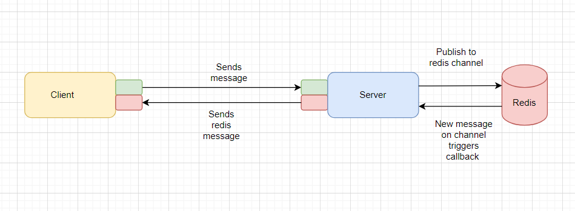

# Introduction

This will be a multi-part series in which we are going to build from scratch a chat application . In this article we are going to build the chat server which is the backbone of the chat application using the following technologies:

- ASP NET Core
- Redis
- Websockets protocol

The chat server will support 4 basic operations:

- subscription to one or multiple chat rooms
- unsubscription from target/all chat rooms
- sending messages to target chat room
- receiving messages from all subscribed chat rooms

## Motivation

Ever since i started playing online games in middle-school back in 2003 (Warcraft 3) , i have been using messaging applications in order to communicate with my peers. The first such application  which in time became ubiquitous was Skype.

I have come to love it since it would enable me and  my friends to:

* send messages
* record audio
* share screen

Besides gaming ,we were also using it  for sharing school material(s) , homework discussions and why not ,  school gossip :D

From then on i started to get a real fascination regarding chat apps , and pretty much any application that would support realtime notifications.

Years after completely abandoning gaming and dabbling for some time in areas such as Industrial Automation , Embedded Devices i rediscovered my passion for chat apps , but this time i was poised to create them.

## General Mechanics

So lets say i am a user Adrian and i want to connect with my buddy , Vasi ,  and start exchanging messages. We will define all interactions between me and Vasi as belonging to a CHANNEL.

A typical flow would be the following:

- channel participant connects to server and subscribes to given channel
- participant starts sending messages to the server to target channel while also receiving incoming messages from target channel
- participant disconnects from the server and subsequentally from channel

Important thing to note is that , at any given time ,  there could be multiple such groups of people wanting to connect and communicate. Therefore , you can view the application as  a group of channels like in the image below:

Another important note is that there is nothing stopping a given user to subscribe to multiple channels.

As you can see from above , all messages sent by a channel participant will be **broadcasted** to **all** members of that channel , including the sender.

# Architecture

## Components

The proposed  solution will be composed of :

- **ASP NET Core Web application** - the server where our logic will run handling client operations (subscribe/unsubscribe/publish message/get channels)
- **Redis DB** serving as:
  - Data bus - we will be using the Publish/Subscribe functionality of Redis in order for clients to receive messages from subscribed channels.More on this can be found in the redis documentation [here](https://redis.io/topics/pubsub).
  - Storage medium , holding client data such as subscribed channel

## Communication

Since this is a chat application where the communication between a connected client and the given server is bidirectional (client sends messages , but also expects notifications from subscribed channel(s) ) ,  the protocol we will be using is **Websockets**.

*The **WebSocket API** is an advanced technology that makes it possible to open a two-way interactive communication session between the user's browser and a server. With this API, you can send messages to a server and receive event-driven responses without having to poll the server for a reply.*

Whenever a client connects to the server , the server will maintain a long running connection with the client and use this connection to receive/deliver messages in an ever going loop.

## Message flow

There are some important considerations that derive from the above picture:

- The server runs a long running session for every connected client
- Every client session is composed of:
  - Inbound loop ( Task ) :
